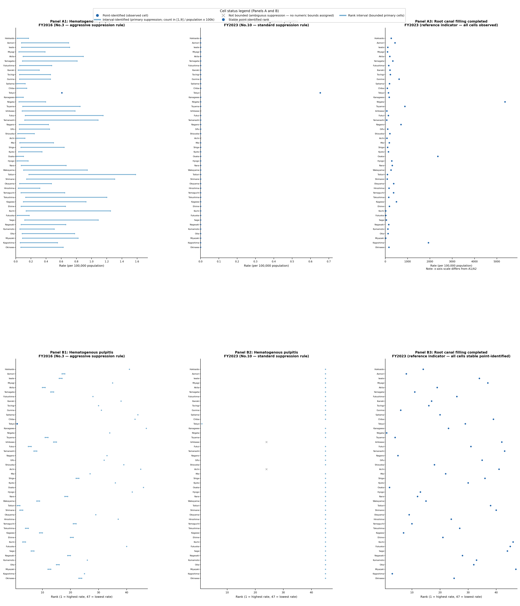

# Known Censoring, Not Missingness: Cell Suppression and Partial Identification in Open Administrative Healthcare Data

## Abstract

Open administrative healthcare datasets suppress small cells for confidentiality, but suppressed values are often analyzed as missing, zero, or imputed counts. We evaluated whether suppression in prefecture-level Dental/Oral files from Japan's NDB Open Data could instead be treated as a known-censoring and partial-identification problem. We inventoried releases No.1 through No.11, verified disclosure rules, classified cells, assigned [1, 9] count bounds only to verified primary low-count suppression, and used population denominators to evaluate rate bounds and ranking support.

Ten disease-count releases were retained; release No.8 was excluded because the metric changed from disease count to claim/calculation count. The retained data contained 311 distinct Dental/Oral indicator labels, 1,511 release-indicator rows, and 71,017 prefecture-level cells. Of these cells, 45,285 were observed and 25,732 were suppressed. Among suppressed cells, 4,982 were primary low-count cells assigned [1, 9] bounds, whereas 20,750 were ambiguous and were not assigned bounds. In a three-indicator rate and ranking demonstration comprising 1,410 cells, 700 cells were point identified, 92 were primary-bounded, and 618 were not numerically bounded. Ranking support was stable for 472 cells, interval-ranked for 320 cells, and not supported for 618 ambiguous cells.

Suppressed cells in public administrative healthcare data are not generic missing values. Some are bounded observations under verified disclosure rules, while others remain ambiguous because of missing rule text or complementary suppression. Known-censoring analysis clarifies which rates and rankings are supported by the public release and which comparisons require assumptions beyond the released data.

Keywords: administrative data; cell suppression; known censoring; partial identification; public data; statistical disclosure control

## 1. Introduction

Public administrative healthcare data are increasingly used for health-services research, surveillance, and secondary analyses because they cover large populations and are publicly accessible. However, public releases are not direct claims extracts. They are measurement products shaped by aggregation, table design, disclosure control, and release-specific documentation.

Small-cell suppression is one of the most consequential features of such releases. Suppressed cells are often treated as missing, removed in complete-case analyses, replaced with zero, or filled by substitution. These approaches do not match the measurement process when suppression follows a disclosure rule.

The central premise of this paper is that a suppressed cell is not automatically a missing value. Under a verified disclosure rule, a suppressed count may be an interval-censored observation. For example, if counts below 10 are suppressed and zero counts are explicitly published as zero, a primary suppressed cell has an identification region of [1, 9]. However, this logic holds only when the suppressed cell is known to be a primary low-count cell. Complementary suppression can suppress additional cells to prevent back-calculation, and those cells may not lie below the threshold.

This distinction matters for inference. Public-data users may wish to estimate regional rates, compare prefectures, rank areas, or examine ecological associations. These quantities are constrained not only by statistical uncertainty but also by what the public release makes identifiable. Bounds describe what can be inferred from the disclosed data and rule; they are not confidence intervals and do not recover hidden values.

We use the Dental/Oral disease-count files in Japan's NDB Open Data as a worked example. Our aims were to verify release-specific disclosure rules, classify cell observability, distinguish primary from ambiguous suppression where possible, and demonstrate how known censoring affects rate bounds and prefecture ranking support.

## 2. Methods

### 2.1 Data Source and Analytic Domain

We analyzed prefecture-level Dental/Oral disease-count files in NDB Open Data releases No.1 through No.11, corresponding to fiscal years 2014 through 2024. Files were inventoried by release, fiscal year, metric label, and geographic unit.

Release No.8 was excluded because the file used a claim/calculation-count metric rather than disease count. The retained series included 10 releases and 311 distinct Dental/Oral indicator labels. Because not every indicator appeared in every release, these labels yielded 1,511 release-indicator rows and 71,017 prefecture-level cells.

### 2.2 Disclosure-Rule Verification

For each release, we inspected the table header and recorded disclosure-rule text when present. Rule status was classified as verified, missing, ambiguous, conflicting, or not applicable. Suppression thresholds were used only when rule text was verified.

Three disclosure-rule variants were identified. Releases No.1 and No.2 had missing disclosure-rule text. Releases No.3 and No.4 used an aggressive complementary suppression rule, under which a single cell below the threshold could lead to suppression of all prefecture cells in the row. Releases No.5 through No.11 used a standard complementary suppression rule, under which the smallest cell or cells at or above the threshold could also be suppressed when exactly one cell was below the threshold. Release No.8 was recorded in the rule inventory but excluded from the disease-count analytic series because of the metric change.

For standard-rule releases, we intentionally used a conservative classification. The public files did not provide sufficient cell-level information to distinguish primary low-count suppression from complementary suppression without additional assumptions. Therefore, when primary and complementary suppressed cells could not be separated using the public release and row context alone, suppressed cells were classified as ambiguous rather than assigned [1, 9] bounds. This rule is detailed in Supplementary Note S1.

### 2.3 Cell-State Classification and Count Bounds

Each retained prefecture-level cell was classified as observed, suppressed, blank, unpublished, not applicable, structurally unavailable, or parse error. Numeric cells were treated as point-identified counts. Suppression marks were treated as suppressed cells only when the symbol matched release-specific notation.

Suppressed cells were further classified by subtype. Cells were classified as primary low-count suppression only when the disclosure rule and row context supported the interpretation that the hidden count was below the threshold. Cells were classified as ambiguous suppression when primary low-count suppression could not be distinguished from complementary suppression or when the disclosure rule was missing. Ambiguous cells were not assigned primary low-count bounds.

For aggressive-rule releases, row context was used as an identification condition. Under this rule, a single below-threshold cell could trigger suppression of all prefecture cells in a row. Therefore, rows containing both observed and suppressed prefecture cells were treated as supporting primary low-count suppression for the suppressed cells, whereas fully suppressed rows were retained as ambiguous. Row patterns that did not match the documented rule were flagged during quality control and not forced into the primary-bounded category.

For verified primary low-count suppression with threshold T=10 and explicit publication of zero counts as 0, the count identification region was defined as [1, 9]. Observed cells were treated as point identified. Ambiguous suppressed cells were retained in the cell-state dataset but excluded from numeric count-bounds analysis.

### 2.4 Population Denominators and Rate Bounds

Prefecture-year population denominators were reconstructed from official primary sources. For FY2014, we used e-Stat table 0003104195. For FY2015 through FY2019, we used e-Stat table 0003459027. For FY2020 and FY2022 through FY2024, we used Statistics Bureau population estimate files. Values reported in thousands were converted to persons; FY2021 was excluded.

The denominator inventory contained 470 prefecture-year rows. Population joins were required to have no missing prefecture-year pairs. Rates were calculated per 100,000 population only when numeric count bounds were supported. Observed cells had identical lower and upper rates. Primary low-count cells had rate bounds [1/population, 9/population] x 100,000. Ambiguous cells were not assigned rate bounds.

### 2.5 Ranking Support

We evaluated whether prefecture rankings were supported by the public release and rate bounds. Point-identified cells with no unsupported ambiguity in the comparison set were classified as stable rankings. Bounded primary cells, and point-identified cells compared with bounded cells, were assigned rank intervals. Ambiguous cells were classified as ranking not supported.

For a given indicator-release comparison, lower and upper rates were denoted L_i and U_i for prefecture i when numeric bounds were available. Ranking used descending rates, with rank 1 indicating the highest rate. For cells with numeric bounds, the best possible rank was defined as 1 plus the number of supported prefectures j with L_j > U_i. The worst possible rank was defined as the number of supported prefectures j with U_j >= L_i. Thus, a point-identified cell had equal best and worst ranks only when its order was not affected by any overlapping interval. Ties were handled conservatively by assigning the broader rank interval. Cells with ambiguous suppression were not assigned L_i, U_i, best rank, or worst rank. If any ambiguous cells were present in an indicator-release comparison, the resulting ordering was described as a supported subset ranking rather than a definitive all-prefecture ranking.

Naive complete-case, zero-substitution, upper-bound, and midpoint rankings were generated only as comparison benchmarks. These strategies were not treated as valid inference. Upper-bound and midpoint substitution were meaningful only for verified primary low-count cells with a [1, 9] identification region; they were not treated as valid bounds for ambiguous or complementary suppression.

### 2.6 Demonstration Indicator Selection

Three demonstration indicators were selected a priori from the post-QC indicator inventory to represent three release-supported states rather than to highlight a favorable substantive result. The bounded demonstration indicator was required to have both observed cells and at least several primary-bounded cells. The stable observed indicator was required to have nearly complete or complete observation and no ambiguous suppression. The ambiguous-limit indicator was required to have substantial ambiguous suppression. Hematogenous pulpitis, root canal filling completed, and localized juvenile periodontitis were selected as representative indicators satisfying these respective observability-profile rules. Selection was therefore based on disclosure-state profile rather than outcome desirability.

### 2.7 Quality Control

All reported counts were recomputed from extraction CSV and JSON outputs. Quality-control checks verified file presence, release inventory, rule-variant assignment, cell-state counts, suppression subtypes, bounds integrity, row-context logic, population joins, naive-strategy labeling, figure-source consistency, and script reproducibility. Rate and ranking analyses were treated as identification exercises, not attempts to recover hidden counts.

## 3. Results

### 3.1 Release Inventory and Rule Variants

NDB Open Data releases No.1 through No.11 were scanned. Ten releases were retained in the Dental/Oral disease-count series. Release No.8 was excluded because its metric was claim/calculation count rather than disease count.

Disclosure-rule structure varied across releases. Releases No.1 and No.2 contained suppressed cells but lacked verified disclosure-rule text. Releases No.3 and No.4 used an aggressive complementary suppression rule. Releases No.5 through No.11 used a standard complementary suppression rule. During row-context QC, one No.3 pattern was flagged as inconsistent with the documented aggressive-rule pattern and was retained as ambiguous. Thus, even within a single domain, the identifiability of suppressed cells depended on release-specific disclosure rules.

### 3.2 Cell Observability

Across the 10 retained releases, 311 distinct indicator labels yielded 1,511 release-indicator rows and 71,017 prefecture-level cells. Of these, 45,285 cells were observed and 25,732 cells were suppressed. No blank cells or parse errors were identified in the retained series. The overall suppression percentage was 36.2%.

Suppression percentages varied by release. Releases No.1 through No.7 showed suppression percentages of approximately 40.6% to 46.9%, whereas releases No.9 through No.11 showed lower suppression percentages of 18.1% to 19.5%. This temporal change should be interpreted cautiously because it may reflect release-level changes in aggregation, coding, or data construction.

### 3.3 Bounds Eligibility

Among 25,732 suppressed cells, 4,982 cells were classified as primary low-count suppression and were assigned the identification region [1, 9]. The remaining 20,750 suppressed cells were classified as ambiguous suppression and were not assigned primary low-count bounds.

Bounds eligibility varied sharply by disclosure-rule variant. In releases No.1 and No.2, all 6,442 suppressed cells were ambiguous because the disclosure rule was missing. In releases No.3 and No.4, 4,982 of 6,392 suppressed cells were primary-bounded under aggressive-rule row-context logic, while 1,410 cells remained ambiguous. In releases No.5 through No.11, excluding No.8, all 12,898 suppressed cells were classified as ambiguous under the standard complementary suppression rule. Thus, a verified rule did not by itself imply numeric identifiability.

### 3.4 Population Denominator Construction

The official population denominator inventory contained 470 prefecture-year rows, covering 47 prefectures over 10 retained fiscal years. Population joins to the Dental/Oral cell-state data had no missing prefecture-year pairs. Validation of candidate denominator sources identified an inconsistency in a previously considered convenience population file: FY2019 prefectural values appeared identical to FY2020 values. The analysis therefore used only official primary sources for population denominators.

### 3.5 Rate Bounds in Demonstration Indicators

Across the three demonstration indicators, the count-bounds and rate-bounds files contained 1,410 prefecture-year cells. Of these, 700 cells were point identified, 92 cells were bounded under the primary low-count rule, and 618 cells were ambiguous suppression cells. Ambiguous cells received no numeric count or rate bounds. Observed cells had identical lower and upper rate bounds, and primary low-count cells had interval bounds corresponding to 1 to 9 events per prefecture-year population.

Hematogenous pulpitis included 143 observed cells, 92 primary-bounded cells, and 235 ambiguous cells. Root canal filling completed had all 470 cells observed. Localized juvenile periodontitis had 87 observed cells and 383 ambiguous cells, providing an example in which public data did not support numeric rate bounds for most prefecture-year cells.

### 3.6 Ranking Support

The ranking-stability analysis also contained 1,410 cells. Rankings were stable and point identified for 472 cells, interval-ranked for 320 cells, and not supported for 618 ambiguous cells. These results show that the public release supports different levels of regional comparison depending on the disclosure state of each indicator-year-prefecture cell. When ambiguous suppression is present, full ranking is not supported unless additional release information becomes available.

### 3.7 Naive Ranking Benchmarks

Naive ranking strategies produced apparent point rankings, but these rankings were not identified by the public release. Complete-case analysis removed suppressed cells; zero substitution contradicted explicit zero publication when zero counts were separately displayed; and upper-bound or midpoint substitution was valid only as a benchmark for verified primary low-count cells. These strategies were therefore retained as comparison benchmarks rather than primary inferential results.

### 3.8 Rate-Bound and Ranking-Support Demonstration

Figure 1 provides the prefecture-level demonstration of rate bounds and ranking support. Panels A and B show that selected indicator-release comparisons contain point-identified rates, interval-identified rates, unbounded ambiguous cells, stable ranks, rank intervals, and unsupported rankings. Naive substitution strategies are shown separately in Supplementary Figure S1 because they are comparison benchmarks rather than primary inferential results.

The full figure-source dataset contained 2,068 rows: 940 rows for rate bounds, 940 rows for rank intervals, and 188 rows for naive comparison. Figure-specific QC confirmed that ambiguous cells received no numeric rate bounds or rank intervals, observed cells had equal lower and upper rates, and all 92 bounded-primary cells had valid numeric intervals.

## 4. Discussion

### 4.1 Principal Findings

This analysis shows that cell suppression in open administrative healthcare data is neither ordinary missingness nor uniformly bounded censoring. In the Dental/Oral NDB Open Data domain, 36.2% of retained prefecture-level cells were suppressed. However, only 19.4% of suppressed cells were eligible for primary [1, 9] bounds. Most suppressed cells were ambiguous because the disclosure rule was missing or because complementary suppression prevented primary low-count cells from being distinguished.

The rate and ranking demonstration extends this finding to regional inference. In the selected 1,410-cell set, nearly half of cells were point identified, a smaller subset had interval-identified rates, and 43.8% were not numerically bounded. Ranking support followed the same logic: stable ranks were available only where the public release supported them.

### 4.2 Implications for Public Administrative Data Analysis

Analyses that treat all suppressed cells as missing, zero, or a fixed substituted count can misrepresent what is identifiable from the public release. Zero substitution is especially problematic when zero counts are explicitly published as 0. Upper-bound or midpoint substitution may be useful as sensitivity benchmarks for verified primary low-count cells, but they are not valid for ambiguous or complementary suppression.

Known-censoring analysis reframes the task. Rather than recovering hidden counts, it distinguishes point-identified cells, bounded primary low-count cells, and cells that remain ambiguous under the public disclosure mechanism. This distinction is directly relevant for regional comparisons, ranking, and ecological analyses based on public aggregate healthcare data.

A counterintuitive implication is that stricter disclosure language may sometimes provide more user-side identification information. In this example, the aggressive-rule releases allowed some primary low-count cells to be bounded through row context, whereas later standard-rule releases were conservatively ambiguous despite lower suppression percentages.

### 4.3 Relation to Partial Identification

The bounds reported here are identification regions implied by the public release and disclosure rule. They should not be interpreted as confidence intervals, posterior intervals, or imputed estimates. Their width reflects the information released to the public, not only statistical uncertainty. For public administrative data, this distinction is essential because some comparisons may be logically unsupported even when the number of rows is large.

### 4.4 Strengths

This study used release-specific disclosure-rule verification rather than assuming a single suppression rule across all files. It separated observed, suppressed, blank, and parse-error states, then further separated primary low-count suppression from ambiguous suppression. It incorporated official population denominators for a prefecture-level rate demonstration and explicitly evaluated ranking support rather than reporting a single ranking. All main counts and figure-source checks were recomputed from structured outputs during quality control.

### 4.5 Limitations

This study reports the Dental/Oral domain only. The rate demonstration used total prefecture population as a public denominator and should be interpreted as a population-rate demonstration, not as disease prevalence or individual-level risk. We did not derive sharp bounds for ambiguous complementary suppression using external constraints; doing so would require assumptions beyond the released files. The No.3 row-context anomaly suggests that documented rules may not always be applied uniformly, and such exceptions should be recorded rather than smoothed over. Finally, NDB Open Data release structures and rule text may differ across other domains, so the findings should not be assumed to generalize without domain-specific rule verification.

## 5. Conclusions

Suppressed cells in public administrative healthcare data are not generic missing values. Some can be treated as bounded observations under verified disclosure rules, but many remain ambiguous because of missing rule text or complementary suppression. In NDB Open Data Dental/Oral disease-count files, suppression constrained not only cell counts but also rate estimation and prefecture ranking. Public-data inference should therefore report not only suppression frequency but also bounds eligibility and the disclosure-rule conditions that determine what is identifiable.

## Declarations

### Ethics statement

This study used publicly available aggregate data and did not use individual-level records or identifiable personal information. Ethics review was not required.

### Data availability

The NDB Open Data files used in this analysis are publicly available from the Japan Ministry of Health, Labour and Welfare (https://www.mhlw.go.jp/stf/seisakunitsuite/bunya/0000177182.html). Population denominator data are publicly available from the Statistics Bureau of Japan (https://www.stat.go.jp/english/data/jinsui/). All analysis code and derived non-suppressed output files are openly available on GitHub (https://github.com/haruki00430/ndb-known-censoring-dental-oral) and permanently archived on Zenodo (https://doi.org/10.5281/zenodo.21257142).

### Funding

No specific funding was received for this work.

### Conflicts of interest

The authors declare no conflicts of interest.

### Author contributions

H.S.: Conceptualization; Methodology; Software; Formal analysis; Investigation; Data curation; Writing – original draft preparation; Visualization. T.O.: Conceptualization; Writing – review and editing; Supervision.

### Acknowledgments

None.

## Tables

### Table 1. Release groups, disclosure-rule variants, and bounds interpretation

| Release group | Releases | Rule status | Rule variant | Disease-count retention | Bounds interpretation |
|---|---|---|---|---|---|
| Missing-rule releases | No.1-No.2 | Rule text missing | Not classified | Retained | Suppression was confirmed, but no numeric bounds were assigned because the threshold was not verified from the public file. |
| Aggressive-rule releases | No.3-No.4 | Verified | Aggressive complementary suppression | Retained | Primary low-count cells were assigned [1, 9] only when row context supported primary suppression; fully suppressed rows remained ambiguous. |
| Standard-rule releases | No.5-No.7, No.9-No.11 | Verified | Standard complementary suppression | Retained | Suppressed cells were classified conservatively as ambiguous when primary and complementary suppression could not be separated from public files alone. |
| Metric-change release | No.8 | Verified | Standard complementary suppression | Excluded | Excluded from the disease-count series because the metric changed to claim/calculation count. |

Note: Detailed release-by-release inventory is provided in Supplementary Table S1. Verified rule text alone does not imply that every suppressed cell is eligible for [1, 9] bounds.

### Table 2. Cell observability by NDB release

| NDB release | Fiscal year | Observed cells | Suppressed cells | Total cells | Suppression (%) | Blank cells | Parse errors | Notes |
|---|---:|---:|---:|---:|---:|---:|---:|---|
| No.1 | 2014 | 3,744 | 3,306 | 7,050 | 46.9 | 0 | 0 |  |
| No.2 | 2015 | 3,867 | 3,136 | 7,003 | 44.8 | 0 | 0 |  |
| No.3 | 2016 | 3,996 | 3,101 | 7,097 | 43.7 | 0 | 0 |  |
| No.4 | 2017 | 3,853 | 3,291 | 7,144 | 46.1 | 0 | 0 |  |
| No.5 | 2018 | 4,187 | 2,863 | 7,050 | 40.6 | 0 | 0 |  |
| No.6 | 2019 | 4,179 | 2,965 | 7,144 | 41.5 | 0 | 0 |  |
| No.7 | 2020 | 4,097 | 3,047 | 7,144 | 42.7 | 0 | 0 |  |
| No.8 | 2021 | - | - | - | - | - | - | Excluded because of metric change. |
| No.9 | 2022 | 5,874 | 1,364 | 7,238 | 18.8 | 0 | 0 |  |
| No.10 | 2023 | 5,789 | 1,402 | 7,191 | 19.5 | 0 | 0 |  |
| No.11 | 2024 | 5,699 | 1,257 | 6,956 | 18.1 | 0 | 0 |  |
| Total | 2014-2024, excluding 2021 | 45,285 | 25,732 | 71,017 | 36.2 | 0 | 0 | No.8 excluded. |

### Table 3. Suppression subtype and known-censoring bounds eligibility

| Release group | Suppressed cells | Primary low-count cells | Ambiguous suppressed cells | Primary-bounded cells | Bounds assigned | Main interpretation |
|---|---:|---:|---:|---:|---|---|
| No.1-No.2, rule missing | 6,442 | 0 | 6,442 | 0 | None | No verified rule text; no bounds assigned. |
| No.3-No.4, aggressive rule | 6,392 | 4,982 | 1,410 | 4,982 | [1, 9] | Primary-bounded cells receive identification region [1, 9]. |
| No.5-No.11 excluding No.8, standard rule | 12,898 | 0 | 12,898 | 0 | None | Primary and complementary cells could not be distinguished; all classified conservatively as ambiguous. |

Note: Identification regions are assigned only to primary low-count cells where the disclosure rule is verified, T=10, and zero is published explicitly. Ambiguous cells do not receive bounds.

### Table 4. Rate-bound and ranking-support results across three demonstration indicators

| Release-supported state | Count/rate status | Cells | Percent of 1,410 cells | Ranking status | Ranking cells | Percent of 1,410 ranking cells | Interpretation |
|---|---|---:|---:|---|---:|---:|---|
| Point identified | Point rate | 700 | 49.6 | Stable rank | 472 | 33.5 | Rates are directly supported by observed counts; rankings are stable when the comparison set is supported. |
| Interval identified | Primary-bounded rate interval | 92 | 6.5 | Rank interval | 320 | 22.7 | Rates and ranks are bounded, but a single point rank is not identified. |
| Not numerically bounded | Ambiguous / no rate bound | 618 | 43.8 | Ranking not supported | 618 | 43.8 | The public release does not support numeric rate bounds or prefecture ranking. |

Note: The denominator for both summaries is 1,410 prefecture-year cells, corresponding to three selected indicators across 10 retained releases and 47 prefectures. Ambiguous suppression cells were not assigned numeric bounds.

## Figures

### Figure 1. Rate bounds and ranking support under known censoring

Panel A shows prefecture-level rate bounds per 100,000 population for selected Dental/Oral indicators and releases. Observed cells are point-identified and shown as points. Primary low-count suppressed cells are interval-identified using the public suppression rule, with count bounds of [1, 9] and corresponding rate bounds of [1/population, 9/population] x 100,000. Ambiguous suppression cells are marked separately and are not assigned numeric rate bounds.

Panel B shows the corresponding ranking support. Stable point-identified ranks are shown as points. Cells with valid primary low-count bounds are shown as rank intervals. Cells with ambiguous suppression are not assigned numeric ranks.

Rate and ranking analyses are identification exercises. They show which regional comparisons are supported by the public release and disclosure rule; they do not recover hidden suppressed counts.

### Supplementary Figure S1. Naive ranking strategies

Naive ranking strategies are provided as Supplementary Figure S1. Complete-case handling, zero substitution, upper-bound substitution, and midpoint substitution produce apparent point rankings, but these rankings are not identified by the public release and should not be interpreted as valid inference.

## References

1. Cox LH. Suppression methodology and statistical disclosure control. Journal of the American Statistical Association. 1980;75(370):377-385.

2. Cox LH. Vulnerability of complementary cell suppression to intruder attack. Journal of Privacy and Confidentiality. 2009;1(2):235-251.

3. Hundepool A, Domingo-Ferrer J, Franconi L, Giessing S, Nordholt ES, Spicer K, de Wolf PP. Statistical Disclosure Control. Chichester: Wiley; 2012.

4. Ritchie F. 10 is the safest number that there's ever been. Transactions on Data Privacy. 2022;15(1):1-29.

5. Manski CF. Nonparametric bounds on treatment effects. American Economic Review. 1990;80(2):319-323.

6. Manski CF. Partial Identification of Probability Distributions. New York: Springer; 2003.

7. Tamer E. Partial identification in econometrics. Annual Review of Economics. 2010;2:167-195.

8. Rubin DB. Inference and missing data. Biometrika. 1976;63(3):581-592.

9. Little RJA, Rubin DB. Statistical Analysis with Missing Data. 2nd ed. Hoboken: Wiley; 2002.

10. Benchimol EI, Smeeth L, Guttmann A, Harron K, Moher D, Petersen I, et al. The REporting of studies Conducted using Observational Routinely-collected health Data (RECORD) statement. PLoS Medicine. 2015;12(10):e1001885.

11. von Elm E, Altman DG, Egger M, Pocock SJ, Gotzsche PC, Vandenbroucke JP; STROBE Initiative. The Strengthening the Reporting of Observational Studies in Epidemiology (STROBE) statement: guidelines for reporting observational studies. PLoS Medicine. 2007;4(10):e296.

12. Jutte DP, Roos LL, Brownell MD. Administrative record linkage as a tool for public health research. Annual Review of Public Health. 2011;32:91-108.

13. Harron K, Dibben C, Boyd J, Hjern A, Azimaee M, Barreto ML, Goldstein H. Challenges in administrative data linkage for research. Big Data & Society. 2017;4(2):1-12.

14. Robinson WS. Ecological correlations and the behavior of individuals. American Sociological Review. 1950;15(3):351-357.

15. Morgenstern H. Ecologic studies in epidemiology: concepts, principles, and methods. Annual Review of Public Health. 1995;16:61-81.

16. Openshaw S. The Modifiable Areal Unit Problem. Norwich: Geo Books; 1984.

17. Japan Ministry of Health, Labour and Welfare. NDB Open Data. Tokyo: Ministry of Health, Labour and Welfare. Available from: https://www.mhlw.go.jp/stf/seisakunitsuite/bunya/0000177182.html. Accessed 2026-07-08.

18. Statistics Bureau of Japan. Population Estimates. Tokyo: Ministry of Internal Affairs and Communications. Available from: https://www.stat.go.jp/english/data/jinsui/. Accessed 2026-07-08.
