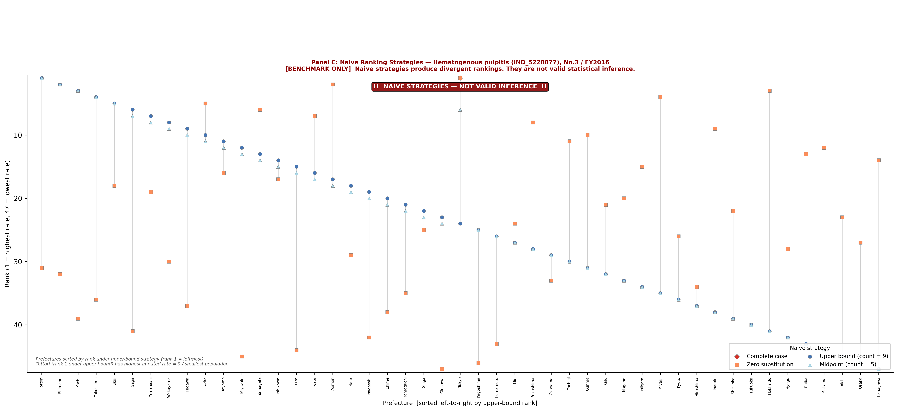

# Supplementary Materials for Known Censoring, Not Missingness

## Supplementary Table S1. Release-by-release inventory and disclosure-rule variant

| NDB release | Fiscal year | Retained | Metric | Rule variant | Threshold | Main note |
|---|---:|---|---|---|---:|---|
| No.1 | 2014 | Yes | Disease count | Missing rule text |  | No suppression-rule text was found in the header. |
| No.2 | 2015 | Yes | Disease count | Missing rule text |  | No suppression-rule text was found in the header. |
| No.3 | 2016 | Yes | Disease count | Aggressive complementary suppression | 10 | Row-context logic supported primary-bounded classification for some cells. |
| No.4 | 2017 | Yes | Disease count | Aggressive complementary suppression | 10 | Row-context logic supported primary-bounded classification for some cells. |
| No.5 | 2018 | Yes | Disease count | Standard complementary suppression | 10 | Suppressed cells were treated conservatively as ambiguous in the primary analysis. |
| No.6 | 2019 | Yes | Disease count | Standard complementary suppression | 10 | Suppressed cells were treated conservatively as ambiguous in the primary analysis. |
| No.7 | 2020 | Yes | Disease count | Standard complementary suppression | 10 | Suppressed cells were treated conservatively as ambiguous in the primary analysis. |
| No.8 | 2021 | No | Claim/calculation count | Standard complementary suppression | 10 | Excluded because the metric was not disease count. |
| No.9 | 2022 | Yes | Disease count | Standard complementary suppression | 10 | Suppressed cells were treated conservatively as ambiguous in the primary analysis. |
| No.10 | 2023 | Yes | Disease count | Standard complementary suppression | 10 | Public-expense claims excluded from FY2023; suppressed cells treated as ambiguous. |
| No.11 | 2024 | Yes | Disease count | Standard complementary suppression | 10 | Public-expense claims excluded; suppressed cells treated as ambiguous. |

Note: Cell-level primary bounds were assigned only where row-context classification supported primary low-count suppression. Verified rule text alone does not imply that every suppressed cell is eligible for [1, 9] bounds.

## Supplementary Table S2. Demonstration indicator profiles

| Demonstration role | Indicator ID | Indicator | Observed cells | Primary-bounded cells | Ambiguous cells | Selection rationale |
|---|---|---|---:|---:|---:|---|
| Bounded demonstration | IND_5220077 | Hematogenous pulpitis | 143 | 92 | 235 | Represents a mixed state with observed, primary-bounded, and ambiguous cells. |
| Stable observed demonstration | IND_5210011 | Root canal filling completed | 470 | 0 | 0 | Represents a fully observed comparison set with point-identified rates and ranks. |
| Ambiguous-limit demonstration | IND_8843319 | Localized juvenile periodontitis | 87 | 0 | 383 | Represents a setting where public files do not support numeric rate bounds or full ranking for most cells. |

## Supplementary Figure S1. Naive ranking strategies

Supplementary Figure S1 compares four naive ranking strategies for hematogenous pulpitis as benchmarks only. Complete-case handling, zero substitution, upper-bound substitution, and midpoint substitution produce apparent point rankings, but these rankings are not identified by the public release. This figure should not be interpreted as valid statistical inference or as recovery of hidden suppressed counts.

## Supplementary Note S1. Conservative Classification in Standard-Rule Releases

In standard-rule releases, suppressed cells were classified conservatively as ambiguous when the public files did not provide enough cell-level information to separate primary low-count suppression from complementary suppression. This rule intentionally restricts the primary analysis to what is identifiable from the public release without additional assumptions. A less conservative analysis might assign bounds to a larger set of cells, but it would require assumptions beyond the released table and disclosure text.
